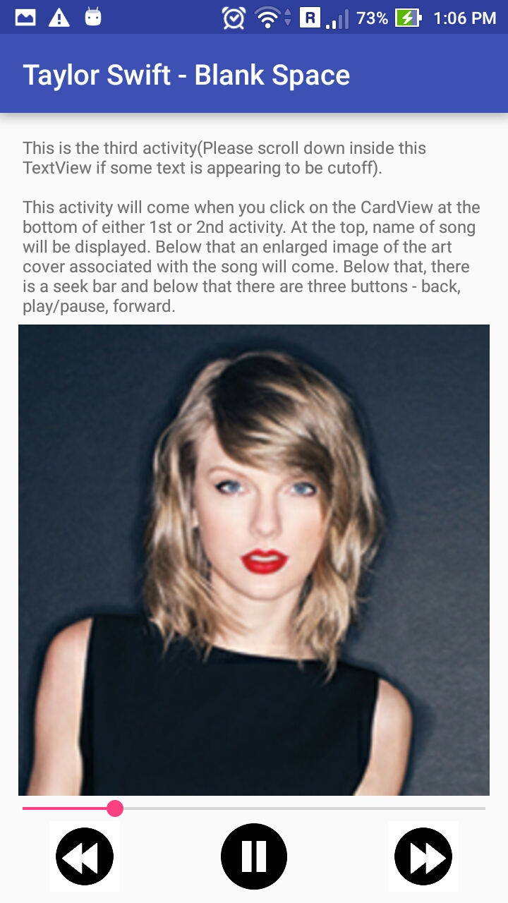

# MuuZic
This app demonstrates a general <b>'structure'</b> of a Music App.

I developed this app after TestMyC app (https://github.com/deeps2/TestMyC) when I started learning android. There are total 3 activities in this app and each one of them have a scrollable TextView containing the description.

Main focus for developing this app is to show how to handle various activities and pass information between them via Intents. By reading the information from Intent object; play/pause button and image thumbail associated with current song will be displayed at the bottom across all the three activites.

ScreenShots
-----------
  

Video Demo
-----------
https://www.youtube.com/watch?v=ijHCwAzRJV0

This app is a project work done by me under Udacity Android Basics Nanodegree. Thanks to course videos provided by Udacity and Google-Images for the pictures used in this app.
